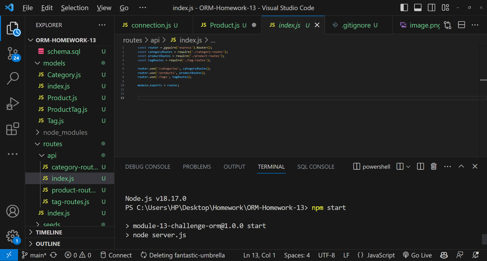

# E-commerce Back End Starter Code

# Description
Task is to create the backend of an Ecommerce store.

## Table of Contents
* [Description](#description)
* [Table of Contents](#table-of-contents)
* [User Story](#user-story)
* [Acceptance Criteria](#acceptance-criteria)
* [Files and Images](#files-and-images)
* [Useage](#usage)
* [Installation](#installation)
* [Credits](#credits)

## User Story

AS A manager at an internet retail company
I WANT a back end for my e-commerce website that uses the latest technologies
SO THAT my company can compete with other e-commerce companies

## Acceptance Criteria

GIVEN a functional Express.js API

WHEN I add my database name, MySQL username, and MySQL password to an environment variable file
THEN I am able to connect to a database using Sequelize

WHEN I enter schema and seed commands
THEN a development database is created and is seeded with test data

WHEN I enter the command to invoke the application
THEN my server is started and the Sequelize models are synced to the MySQL database

WHEN I open API GET routes in Insomnia Core for categories, products, or tags
THEN the data for each of these routes is displayed in a formatted JSON

WHEN I test API POST, PUT, and DELETE routes in Insomnia Core
THEN I am able to successfully create, update, and delete data in my database

## Files and Images

[Running database and tables](image-1.png)

## Usage 

sequelize, mysql2, express, node

## Installation

This is a backend program, therefore, it needs to be run in Insomnia.  To run you must install: sequelize, mysql2, express and node.
A npm i dotenv must also be run. Then do an npm i and an npm start.
Once the packages are installed open Insomnia to view the databases.

## Credits
Used Github Co-Pilot.
I worked on this myself with the help of my tutor, Scott Everett.  I also referred to the class activities for Module 13.